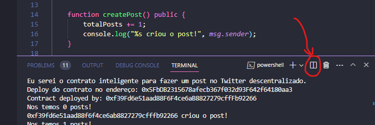
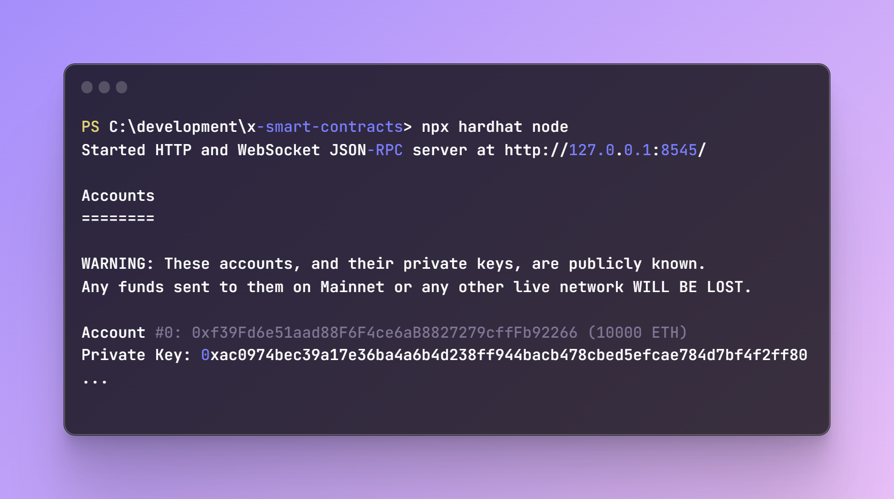
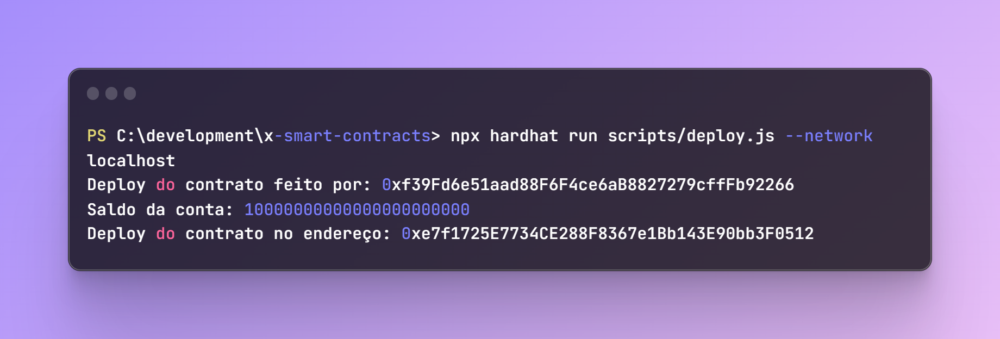
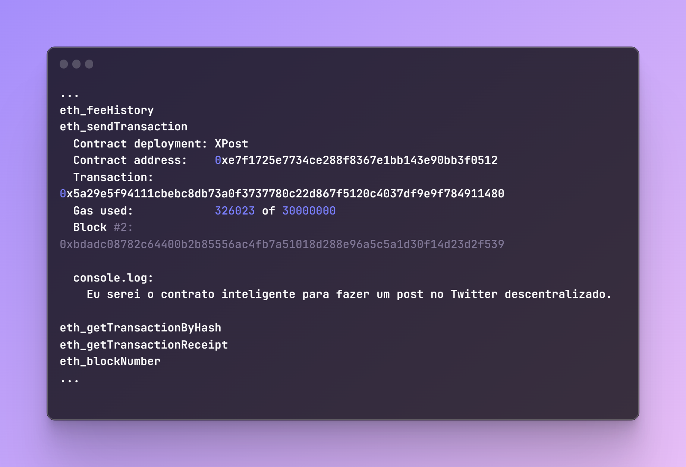

## Como criar uma blockchain local usando Hardhat

"Ué, a gente não tá subindo uma blockchain local quando rodamos o comando `npx hardhat run`?"

Sim, isso é verdade. Mas o Hardhat apaga todos os blocos (registros) daquela blockchain quando termina de executar as funções do arquivo `run.js`.

Para ter uma blockchain rodando na sua máquina por tempo indeterminado (até você encerrá-la), você deverá abrir uma nova instância do terminal clicando aqui:



Depois rodará o seguinte script no novo terminal `npx hardhat node` e deverá aparecer algo semelhante à isso:



Com isso o Hardhat iniciará uma blockchain na sua máquina e **você poderá interagir com ela quando tiver criando a sua aplicação** e consumindo as funções do contrato inteligente que criou.

Além disso, quando o Hardhat inicializa essa blockchain, ele já cria várias contas com **10000 de Ethereum de teste** cada, então você não precisa se preocupar em as taxas de transação (GAS) que são necessárias cada vez que você interage com a blockchain.

## Fazendo o deploy dos contratos inteligentes na blockchain local

Agora que já está rodando uma blockchain que se mantém "viva" por tempo indeterminado, teremos que criar um novo arquivo chamado `deploy.js` dentro da pasta `script` muito semelhante ao `run.js` só que com alguns detalhes atualizados.

Então sempre usaremos o arquivo `run.js` para testar os contratos inteligentes rapidamente e o arquivo `deploy.js` para subir os contratos inteligentes na sua blockchain local e testar com sua aplicação web (no nosso caso vai ser o projeto do Twitter Descentralizado).

Então para começar nós colocaremos o seguinte código dentro do arquivo `deploy.js`:

```js [deploy.js]
const main = async () => {
  const [owner] = await hre.ethers.getSigners();
  const accountBalance = await owner.provider.getBalance(owner.address);

  console.log("Deploy do contrato feito por:", owner.address);
  console.log("Saldo da conta:", accountBalance.toString());

  const xPost = await hre.ethers.deployContract("XPost");
  await xPost.waitForDeployment();

  console.log("Deploy do contrato no endereço:", xPost.target);
};

const runMain = async () => {
  try {
    await main();
    process.exit(0);
  } catch (error) {
    console.log(error);
    process.exit(1);
  }
};

runMain();
```

Agora é só rodar o comando `npx hardhat run scripts/deploy.js --network localhost` no primeiro terminal (sem ser o que você está rodando a blockchain) e você verá algo assim depois de finalizar:



Já no terminal que está rodando sua blockchain local, você vai perceber que apareceu uma mensagem semelhante à isso:



Pronto! Agora você tem uma blockchain rodando na sua máquina e o contrato inteligente `XPost.sol` já faz parte da sua blockchain.

Uma coisa interessante é que, sempre que fizermos uma transação na blockchain, essa transação terá uma taxa de GAS. Você pode ver no último print aqui em cima uma linha mostrando `Gas used: 326023 of 30000000`.

O GAS é basicamente o **cálculo do poder computacional realizado para fazer aquela transação**, então esse GAS deve ser pago no mesmo token da blockchain. No nosso caso estamos utilizando toda infraestrutura da blockchain Ethereum, então pagaremos o GAS com tokens ETH.

> Só lembrando que tudo que a gente fez agora foi realizado num ambiente de teste, então todos os dados, tokens e transações são fakes, você não precisa de ter criptomoedas ou investir dinheiro para finalizar o curso.